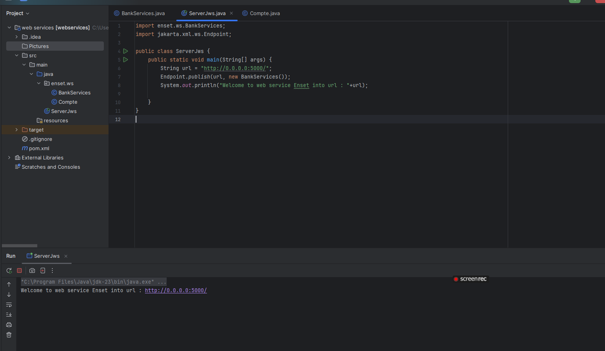
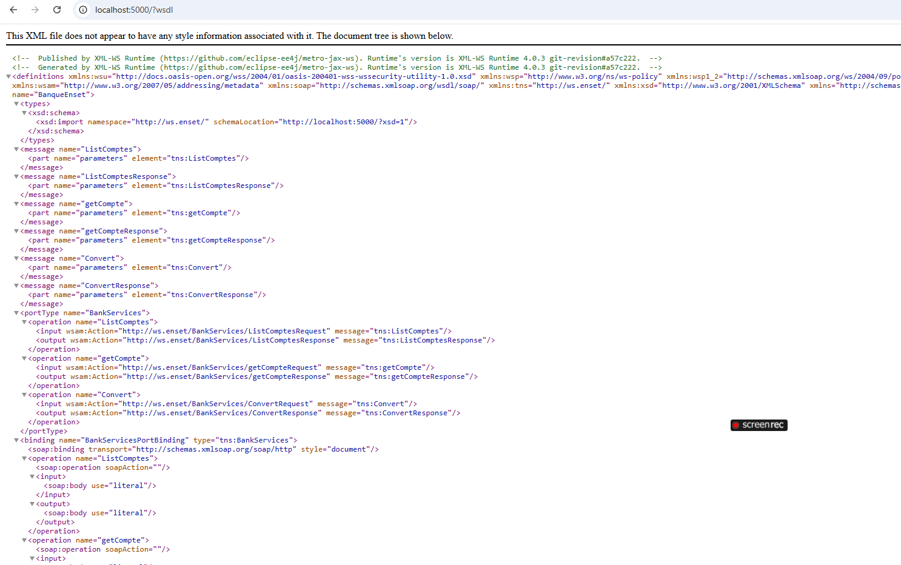
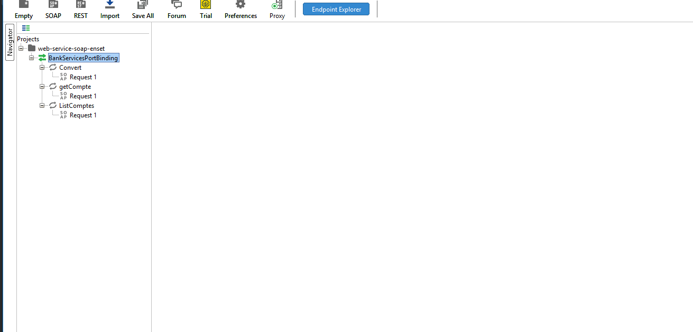
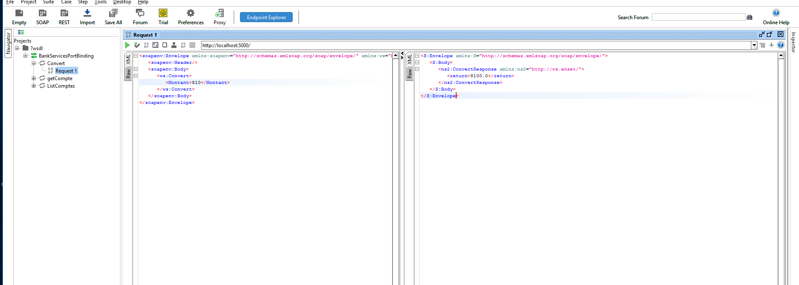
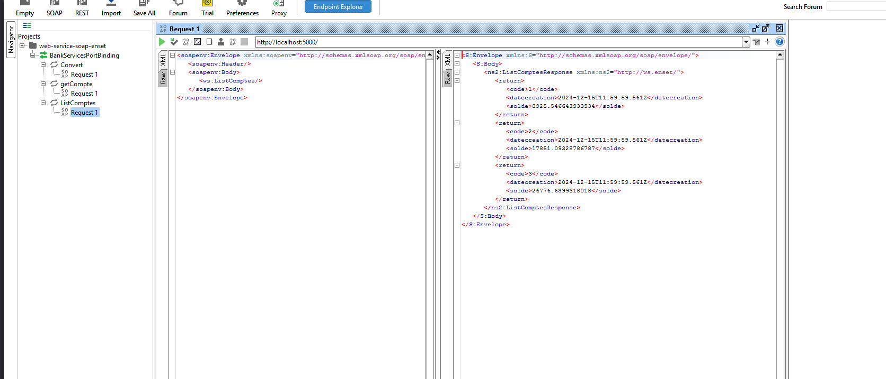
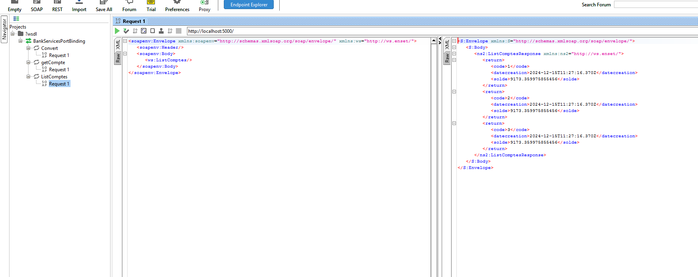
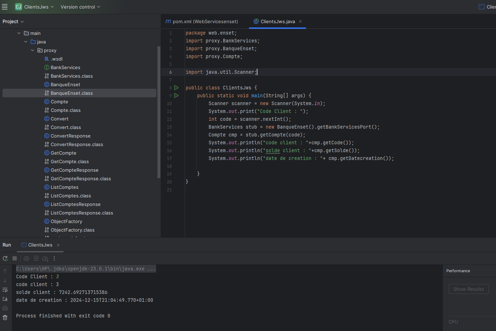
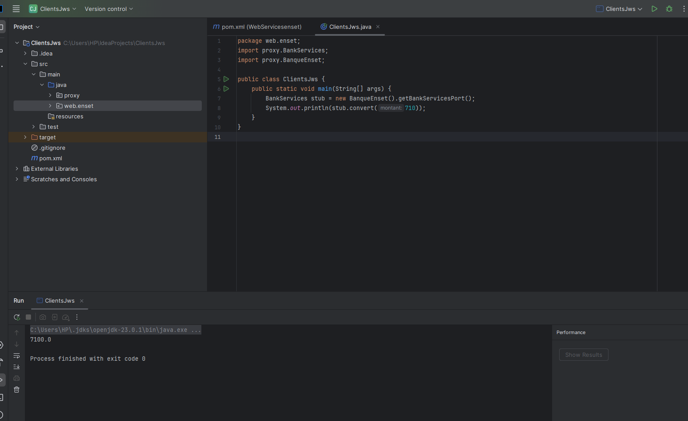

# Project Title: Java POO JWS

This is a project demonstrating Java POO with JWS.

## Requirements

Before running the project, ensure you have the following installed:

- **JDK 23**: Download from the official [JDK 23 website](https://jdk.java.net/23/).
- **SoapUI**: You can download the latest version of SoapUI from [here](https://www.soapui.org/downloads/soapui/).
- **JetBrains IntelliJ IDEA Ultimate 2024.3**: Download from [JetBrains official website](https://www.jetbrains.com/idea/download/).
  
Additionally, you will need the **Maven** build tool to manage dependencies.

## Adding Dependencies

Make sure to add the following dependency to your `pom.xml` file for JAX-WS RI support.

### Add the Dependency to `pom.xml`

In your `pom.xml`, add the following dependency to include `jaxws-ri`:

```xml
<dependency>
    <groupId>com.sun.xml.ws</groupId>
    <artifactId>jaxws-ri</artifactId>
    <version>2.3.0</version>
</dependency>

# Project Title: Java POO JWS

This is a project demonstrating Java POO with JWS.

## Images

Below are some screenshots showing different phases and tests.

### 01. Phase 1


### 02. Phase 2


### 03. Phase 3

#### 03-01: Phase Test


#### 03-02: Phase Test Convert


#### 03-03: Phase Test Get Compte


#### 03-04: Phase Test List Compte


### 04. Phase 4

#### 04-01: JWS Test


#### 04: JWS Test


---

## Usage

To use the project, follow the instructions below.

1. Clone the repository:

   ```bash
   git clone https://github.com/yourusername/java-poo-jws.git
