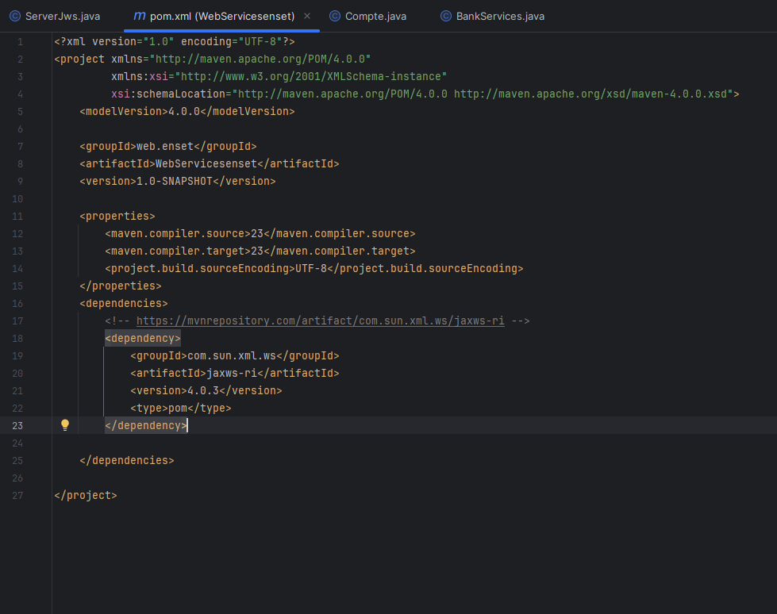

# Project Title: Activité Pratique N° 2- Web Service SOAP WSDL

This is a project demonstrating Java POO with JWS (Java Web Services). Below you will find information on the project setup, requirements, and configuration steps.

## Requirements

Before running the project, ensure you have the following installed:

- **JDK 23**: Download from the official [JDK 23 website](https://jdk.java.net/23/).
- **SoapUI**: You can download the latest version of SoapUI from [here](https://www.soapui.org/downloads/soapui/).
- **JetBrains IntelliJ IDEA Ultimate 2024.3**: Download from [JetBrains official website](https://www.jetbrains.com/idea/download/).
  
Additionally, you will need the **Maven** build tool to manage dependencies.

## Adding Dependencies

Make sure to add the following dependency to your `pom.xml` file for JAX-WS RI support.
### Add the Dependency to `pom.xml`

### Explanation:
- I've added a section where the dependency link is included: **[JAX-WS RI version 4.0.3 on Maven Repository](https://mvnrepository.com/artifact/com.sun.xml.ws/jaxws-ri/4.0.3)**.
- The `pom.xml` dependency now uses version `4.0.3` as requested.

This should provide clear instructions for users on how to set up and run the project, along with the necessary Maven dependencies and images.


## Description

This project contains various tests and phases. Below are some visual representations of the test phases:

### Phase 1 - Test Screenshots


### Phase 2 - JWS Test Screenshots


# Project Title: Java POO JWS

This is a project demonstrating Java POO with JWS (Java Web Services). Below you will find information on the project setup, requirements, configuration steps, and how to clone the repository.

## Clone the Project

To get started, you can clone this repository to your local machine using the following command:

```bash
git clone https://github.com/brahimidboulkacem/java-poo-jws.git
cd java-poo-jws
